# single_check_signal_status 函数流程图

## 函数功能
检查所有信号灯状态，包括所有灯全灭、单方向信号灯不亮、单个相位灯不亮。

## 流程图

```mermaid
flowchart TD
    Start([开始]) --> Init[初始化变量和标志]
    Init --> LoopType[遍历灯类型<br/>远灯, 近灯]
    LoopType --> LoopDir[遍历方向<br/>北 东 南 西]
    LoopDir --> InitFlags[初始化方向标志<br/>light_dir_off = 1<br/>has_valid_channel = 0]
    InitFlags --> LoopRoad[遍历道路类型<br/>主道 辅道]
    LoopRoad --> LoopPhase[遍历相位<br/>左转 直行 右转 行人1 行人2 非机动车1 非机动车2 掉头 可变 逆向可变 潮汐]
    LoopPhase --> LoopColor[遍历颜色<br/>红 黄 绿]
    
    LoopColor --> CheckPtr{电压和电流<br/>指针是否有效?}
    CheckPtr -->|否| NextColor[继续下一个颜色]
    CheckPtr -->|是| MarkValid[标记有有效通道<br/>has_valid_channel = 1]
    
    MarkValid --> ReadValue[读取电压和电流值]
    ReadValue --> CheckLight{灯亮判断}
    CheckLight -->|voltage == 1| SetLightOn1[表示当前灯亮<br/>light_dir_off = 0<br/>light_all_off = 0]
    CheckLight -->|voltage == 0且current > 10| SetLightOn2[表示当前灯亮<br/>light_dir_off = 0<br/>light_all_off = 0]
    CheckLight -->|其他| NextColor
    
    SetLightOn1 --> NextColor
    SetLightOn2 --> NextColor
    NextColor --> EndColor[结束颜色遍历]
    EndColor --> CheckBreakPhase{方向不全灭?}
    
    CheckBreakPhase -->|是| BreakPhase[跳出相位循环]
    CheckBreakPhase -->|否| NextPhase{相位遍历完成?}
    NextPhase -->|否| LoopPhase
    NextPhase -->|是| EndPhase[结束相位遍历]
    
    BreakPhase --> EndPhase
    EndPhase --> CheckBreakRoad{方向不全灭?}
    CheckBreakRoad -->|是| BreakRoad[跳出道路类型循环]
    CheckBreakRoad -->|否| NextRoad{道路遍历完成?}
    NextRoad -->|否| LoopRoad
    NextRoad -->|是| EndRoad[结束道路类型遍历]
    
    BreakRoad --> EndRoad
    EndRoad --> CheckDirOff{方向全灭且<br/>有有效通道?}
    
    CheckDirOff -->|是| SetFault[设置故障<br/>TrafficFault_Set<br/>TRAFFIC_PART_NO_LIGHT]
    SetFault --> SetErrorCode["设置错误码<br/>error_code.fault |= 1 &lt;&lt; LED_PART_NO_LIGHT<br/>error_code.type |= 1 &lt;&lt; type<br/>error_code.dir |= 1 &lt;&lt; dir"]
    SetErrorCode --> NextDirCheck
    CheckDirOff -->|否| ClearFault[清除故障<br/>TrafficFault_Clear<br/>TRAFFIC_PART_NO_LIGHT]
    ClearFault --> NextDirCheck
    
    NextDirCheck{方向遍历完成?}
    NextDirCheck -->|否| LoopDir
    NextDirCheck -->|是| EndDir[结束方向遍历]
    EndDir --> NextType{灯类型遍历完成?}
    NextType -->|否| LoopType
    NextType -->|是| EndType[结束灯类型遍历]
    
    EndType --> CheckAllOff{所有灯全灭?}
    CheckAllOff -->|是| SetAllOffFault["设置全灭故障<br/>error_code.fault |= 1 &lt;&lt; LED_ALL_NO_LIGHT<br/>TrafficFault_Set<br/>TRAFFIC_ALL_NO_LIGHT"]
    SetAllOffFault --> ClearAllDirFault[清除所有方向不亮故障<br/>遍历type和dir<br/>TrafficFault_Clear<br/>TRAFFIC_PART_NO_LIGHT]
    ClearAllDirFault --> Return
    CheckAllOff -->|否| ClearAllOffFault[清除全灭故障<br/>TrafficFault_Clear<br/>TRAFFIC_ALL_NO_LIGHT]
    ClearAllOffFault --> Return
    
    Return([返回 error_code])
    
    style Start fill:#90EE90
    style Return fill:#FFB6C1
    style CheckPtr fill:#87CEEB
    style CheckLight fill:#87CEEB
    style CheckBreakPhase fill:#87CEEB
    style CheckBreakRoad fill:#87CEEB
    style CheckDirOff fill:#87CEEB
    style CheckAllOff fill:#87CEEB
    style SetFault fill:#FF6347
    style SetAllOffFault fill:#FF6347
    style ClearFault fill:#32CD32
    style ClearAllOffFault fill:#32CD32
    style ClearAllDirFault fill:#32CD32
```

## 变量说明

| 变量名 | 类型 | 说明 |
|--------|------|------|
| type | Type_e | 灯类型：远灯/近灯 |
| dir | Direction_e | 方向：北/东/南/西 |
| road | RoadType_e | 道路类型：主道/辅道 |
| phase | Phase_e | 相位：左转/直行/右转/人行1/人行2/非机动车1/非机动车2/掉头/可变/逆向/潮汐 |
| color | Color_e | 颜色：红/绿/黄 |
| current_value | float | 电流值 |
| voltage_value | uint8_t | 电压值 |
| light_dir_off | uint8_t | 方向是否全灭：1=全灭，0=不全灭 |
| light_all_off | uint8_t | 所有灯是否全灭：1=全灭，0=不全灭 |
| has_valid_channel | uint8_t | 是否有有效通道：1=有，0=无 |
| error_code | ErrorCode_t | 错误码结构 |

## 故障类型

| 故障类型 | 说明 |
|----------|------|
| TRAFFIC_PART_NO_LIGHT | 单方向信号灯不亮 |
| TRAFFIC_ALL_NO_LIGHT | 所有灯全灭 |
| LED_PART_NO_LIGHT | 单方向不亮故障位 |
| LED_ALL_NO_LIGHT | 全灭故障位 |

## 逻辑说明

1. **灯亮判断条件**：
   - 当电压为1时（不输出电压），不判断故障，但标记灯亮
   - 当电压为0（低电平）且电流大于10mA时，标记灯亮

2. **方向全灭判断**：方向内所有灯都不亮（light_dir_off = 1）且有有效通道

3. **全灭判断**：所有灯都不亮（light_all_off = 1）

4. **故障处理**：
   - 当方向全灭时，设置单方向不亮故障
   - 当所有灯全灭时，设置全灭故障并清除所有方向不亮故障
   - 当有灯亮时，清除对应方向的故障

5. **优化点**：
   - 一旦发现某个方向有灯亮，立即跳出内层循环，提高效率
   - 只有在有有效通道的情况下才判断方向全灭故障
   - 全灭故障优先级高于方向不亮故障，当所有灯全灭时会清除所有方向不亮故障