# single_check_phase_red_green_simultaneous 函数流程图

## 函数功能

该函数用于检查交通信号灯是否存在红绿灯同时亮的故障。函数通过遍历所有灯类型、方向、道路类型和相位，检查红灯和绿灯是否同时亮，并排除绿灯电压变化后的1.5秒内的误报情况。

## 流程图

```mermaid
flowchart TD
    Start([开始]) --> Init[初始化变量]
    Init --> LoopType[遍历所有灯类型<br/>远灯, 近灯]
    LoopType --> LoopDir[遍历所有方向<br/>北 东 南 西]
    LoopDir --> LoopRoad[遍历所有道路类型<br/>主道 辅道]
    LoopRoad --> LoopPhase[遍历所有相位]
    LoopPhase --> InitFlags[初始化标志<br/>red_on = 0<br/>green_on = 0]
    
    InitFlags --> CheckRedPtr{红灯电压和电流<br/>指针是否有效?}
    CheckRedPtr -->|否| CheckGreenPtr[检查绿灯电压和电流指针是否有效]
    CheckRedPtr -->|是| ReadRedCurrent[读取红灯电流值]
    ReadRedCurrent --> CheckRedOn{红灯电流是否>=10mA?}
    CheckRedOn -->|是| SetRedOn[设置red_on = 1]
    CheckRedOn -->|否| CheckGreenPtr
    SetRedOn --> CheckGreenPtr
    
    CheckGreenPtr -->|否| CheckGreenVoltage[检查绿灯电压指针是否有效]
    CheckGreenPtr -->|是| ReadGreenCurrent[读取绿灯电流值]
    ReadGreenCurrent --> CheckGreenOn{绿灯电流是否>=10mA?}
    CheckGreenOn -->|是| SetGreenOn[设置green_on = 1]
    CheckGreenOn -->|否| CheckGreenVoltage
    SetGreenOn --> CheckGreenVoltage
    
    CheckGreenVoltage -->|否| CheckRG[检查红绿是否同时亮]
    CheckGreenVoltage -->|是| ReadGreenVoltage[读取绿灯电压值]
    ReadGreenVoltage --> CheckVoltageChange{绿灯电压是否变化?}
    CheckVoltageChange -->|是| UpdateVoltageState[更新绿灯电压状态<br/>记录变化时间<br/>设置changed = 1]
    CheckVoltageChange -->|否| UpdatePrevVoltage[更新prev电压值]
    UpdateVoltageState --> UpdatePrevVoltage
    UpdatePrevVoltage --> CheckChangedTime{是否在电压变化后的1.5秒内?}
    CheckChangedTime -->|是| CheckRG
    CheckChangedTime -->|否| ResetChanged[重置changed标志为0]
    ResetChanged --> CheckRG
    
    CheckRG -->|red_on且green_on且!changed| SetFault[设置TRAFFIC_RED_GREEN_SAME_LIGHT故障]
    CheckRG -->|否| ClearFault[清除TRAFFIC_RED_GREEN_SAME_LIGHT故障]
    
    SetFault --> SetErrorCode["设置错误码<br/>error_code.fault = 1 &lt;&lt; LED_RED_GREEN_SAME_LIGHT<br/>error_code.type |= 1 &lt;&lt; type<br/>error_code.dir |= 1 &lt;&lt; dir<br/>error_code.road |= 1 &lt;&lt; road<br/>error_code.phase |= 1 &lt;&lt; phase"]
    SetErrorCode --> NextPhase{相位遍历完成?}
    ClearFault --> NextPhase
    
    NextPhase -->|否| LoopPhase
    NextPhase -->|是| EndPhase[结束相位遍历]
    EndPhase --> NextRoad{道路类型遍历完成?}
    NextRoad -->|否| LoopRoad
    NextRoad -->|是| EndRoad[结束道路类型遍历]
    EndRoad --> NextDir{方向遍历完成?}
    NextDir -->|否| LoopDir
    NextDir -->|是| EndDir[结束方向遍历]
    EndDir --> NextType{灯类型遍历完成?}
    NextType -->|否| LoopType
    NextType -->|是| EndType[结束灯类型遍历]
    EndType --> Return([返回 error_code])
    
    style Start fill:#90EE90
    style Return fill:#FFB6C1
    style CheckRedPtr fill:#87CEEB
    style CheckGreenPtr fill:#87CEEB
    style CheckRedOn fill:#87CEEB
    style CheckGreenOn fill:#87CEEB
    style CheckVoltageChange fill:#87CEEB
    style CheckChangedTime fill:#87CEEB
    style CheckRG fill:#87CEEB
    style SetFault fill:#FF6347
    style ClearFault fill:#32CD32
```

## 变量说明

| 变量名 | 类型 | 说明 |
|--------|------|------|
| type | Type_e | 灯类型：远灯/近灯 |
| dir | Direction_e | 方向：北/东/南/西 |
| road | RoadType_e | 道路类型：主道/辅道 |
| phase | Phase_e | 相位 |
| red_current | float | 红灯电流值 |
| green_current | float | 绿灯电流值 |
| red_on | uint8_t | 红灯是否亮：1=亮，0=不亮 |
| green_on | uint8_t | 绿灯是否亮：1=亮，0=不亮 |
| current_time | uint32_t | 当前运行时间 |
| green_voltage | uint8_t | 绿灯电压值 |
| error_code | ErrorCode_t | 错误码结构 |

## 逻辑说明

1. **灯亮判断条件**：
   - 当红灯电流>=10mA时，认为红灯亮
   - 当绿灯电流>=10mA时，认为绿灯亮

2. **电压变化检测**：
   - 检测绿灯电压是否变化
   - 当绿灯电压变化时，记录变化时间并设置changed标志
   - 1.5秒后重置changed标志

3. **红绿同亮判断**：
   - 当红灯和绿灯同时亮，且不在绿灯电压变化后的1.5秒内时，判断为故障

4. **故障处理**：
   - 当检测到红绿同亮故障时，设置TRAFFIC_RED_GREEN_SAME_LIGHT故障
   - 否则清除该故障

5. **优化点**：
   - 排除绿灯电压变化后的1.5秒内的误报，提高检测准确性
   - 只在指针有效的情况下读取电流和电压值，避免空指针异常