# single_check_single_light_status 函数流程图

## 函数功能

该函数用于检查单个交通信号灯的状态，包括灯不亮、部分灯亮等故障。函数通过多层遍历检查所有灯的状态，并根据电流值与阈值的比较来判断灯的状态。同时，函数还处理了脉冲信号跳变和电平跳变的情况，避免在状态切换过程中产生误报。

## 流程图

```mermaid
flowchart TD
    Start([开始]) --> Init[初始化变量]
    Init --> SetThresholds[设置电流判断阈值和百分比]
    SetThresholds --> LoopType[遍历所有灯类型<br/>远灯, 近灯]
    LoopType --> LoopDir[遍历所有方向<br/>北 东 南 西]
    LoopDir --> LoopRoad[遍历所有道路类型<br/>主道 辅道]
    LoopRoad --> LoopPhase[遍历所有相位]
    LoopPhase --> LoopColor[遍历所有颜色<br/>红 黄 绿]
    
    LoopColor --> CheckPtrs{电压、电流和脉冲<br/>指针是否有效?}
    CheckPtrs -->|否| ClearFaults[清除相关故障并继续]
    CheckPtrs -->|是| ReadValues[读取电压、电流和脉冲值]
    
    ReadValues --> CheckPulseChange{脉冲信号是否跳变?<br/>prev=0且当前=1}
    CheckPulseChange -->|是| RecordPulseTime[记录脉冲检测开始时间<br/>设置detected=1]
    CheckPulseChange -->|否| UpdatePulsePrev[更新上一次脉冲值]
    RecordPulseTime --> UpdatePulsePrev
    
    UpdatePulsePrev --> CheckPulseDetected{是否在脉冲检测后的等待期内?}
    CheckPulseDetected -->|是| ContinueLoop[跳过检测，继续下一个颜色]
    CheckPulseDetected -->|否| ResetPulseState[重置脉冲状态<br/>设置cur_ctd_type=CTD_SINGLE_CTD]
    
    ResetPulseState --> CheckVoltageChange{电压是否跳变?}
    CheckVoltageChange -->|否| CheckHighChanged{是否在高电平跳变后的等待期内?}
    CheckVoltageChange -->|是| CheckLowToHigh{是否是低电平跳变?<br/>prev=0且当前=1}
    
    CheckLowToHigh -->|是| RecordLowChangeTime[记录低电平跳变时间<br/>设置low_changed=1]
    CheckLowToHigh -->|否| CheckHighToLow{是否是高电平跳变?<br/>prev=1且当前=0}
    CheckHighToLow -->|是| RecordHighChangeTime[记录高电平跳变时间<br/>设置high_changed=1]
    CheckHighToLow -->|否| UpdateVoltagePrev[更新上一次电压值]
    RecordLowChangeTime --> UpdateVoltagePrev
    RecordHighChangeTime --> UpdateVoltagePrev
    
    UpdateVoltagePrev --> CheckLowChanged{是否在低电平跳变后的等待期内?}
    CheckLowChanged -->|是| CheckLowDelay{是否超过低电平跳变延时时间?<br/>且voltage==1}
    CheckLowChanged -->|否| CheckHighChanged
    CheckLowDelay -->|是| ResetLowState[重置低电平跳变状态<br/>设置cur_ctd_type=CTD_SINGLE]
    CheckLowDelay -->|否| ContinueLoop
    
    ResetLowState --> CheckHighChanged
    CheckHighChanged -->|是| CheckHighDelay{是否超过高电平跳变延时时间?<br/>且voltage==0}
    CheckHighChanged -->|否| CheckVoltageZero{voltage是否为0?}
    CheckHighDelay -->|是| ResetHighState[重置高电平跳变状态]
    CheckHighDelay -->|否| ContinueLoop
    
    ResetHighState --> CheckVoltageZero
    CheckVoltageZero -->|否| ContinueLoop
    CheckVoltageZero -->|是| GetCurrentThreshold[获取电流判断阈值]
    
    GetCurrentThreshold --> CheckCurrentLevel{电流值与阈值的关系?}
    CheckCurrentLevel -->|current <= 阈值*35%| SetNoLight[设置灯不亮故障<br/>TRAFFIC_SINGLE_NO_LIGHT]
    CheckCurrentLevel -->|current <= 阈值*60%| SetPartLight[设置部分灯亮故障<br/>TRAFFIC_SINGLE_PART_LIGHT]
    CheckCurrentLevel -->|current > 阈值*60%| ClearLightFaults[清除灯不亮和部分灯亮故障]
    
    SetNoLight --> UpdateErrorCode1[更新错误码<br/>LED_SINGLE_NO_LIGHT]
    SetPartLight --> UpdateErrorCode2[更新错误码<br/>LED_SINGLE_PART_LIGHT]
    ClearLightFaults --> ContinueLoop
    
    UpdateErrorCode1 --> ContinueLoop
    UpdateErrorCode2 --> ContinueLoop
    ContinueLoop --> EndColor[结束颜色遍历]
    ClearFaults --> EndColor
    
    EndColor --> NextColor{颜色遍历完成?}
    NextColor -->|否| LoopColor
    NextColor -->|是| EndPhase[结束相位遍历]
    EndPhase --> NextPhase{相位遍历完成?}
    NextPhase -->|否| LoopPhase
    NextPhase -->|是| EndRoad[结束道路类型遍历]
    EndRoad --> NextRoad{道路类型遍历完成?}
    NextRoad -->|否| LoopRoad
    NextRoad -->|是| EndDir[结束方向遍历]
    EndDir --> NextDir{方向遍历完成?}
    NextDir -->|否| LoopDir
    NextDir -->|是| EndType[结束灯类型遍历]
    EndType --> NextType{灯类型遍历完成?}
    NextType -->|否| LoopType
    NextType -->|是| Return([返回 error_code])
    
    style Start fill:#90EE90
    style Return fill:#FFB6C1
    style CheckPtrs fill:#87CEEB
    style CheckPulseChange fill:#87CEEB
    style CheckPulseDetected fill:#87CEEB
    style CheckVoltageChange fill:#87CEEB
    style CheckLowToHigh fill:#87CEEB
    style CheckHighToLow fill:#87CEEB
    style CheckLowChanged fill:#87CEEB
    style CheckLowDelay fill:#87CEEB
    style CheckHighChanged fill:#87CEEB
    style CheckHighDelay fill:#87CEEB
    style CheckVoltageZero fill:#87CEEB
    style CheckCurrentLevel fill:#87CEEB
    style SetNoLight fill:#FF6347
    style SetPartLight fill:#FFA500
    style ClearLightFaults fill:#32CD32
    style ClearFaults fill:#32CD32
```

## 变量说明

| 变量名 | 类型 | 说明 |
|--------|------|------|
| type | Type_e | 灯类型：远灯/近灯 |
| dir | Direction_e | 方向：北/东/南/西 |
| road | RoadType_e | 道路类型：主道/辅道 |
| phase | Phase_e | 相位 |
| color | Color_e | 颜色：红/绿/黄 |
| voltage_value | uint8_t | 电压值 |
| current_value | float | 电流值 |
| pulse_value | uint8_t | 脉冲值 |
| current_time | uint32_t | 当前运行时间 |
| transition_time | uint32_t | 过渡时间 |
| error_code | ErrorCode_t | 错误码结构 |
| current_threshold | float[] | 电流判断阈值 |
| current_threshold_percent | uint8_t[] | 电流阈值百分比 |

## 逻辑说明

1. **初始化阶段**：
   - 初始化所有必要的变量
   - 设置电流判断阈值和百分比

2. **多层遍历**：
   - 遍历所有灯类型（远灯/近灯）
   - 遍历所有方向（北/东/南/西）
   - 遍历所有道路类型（主道/辅道）
   - 遍历所有相位
   - 遍历所有颜色（红/绿/黄）

3. **指针有效性检查**：
   - 检查电压、电流和脉冲指针是否有效
   - 如果无效，清除相关故障并继续下一个灯

4. **脉冲信号处理**：
   - 检测脉冲信号跳变（从0到1）
   - 记录脉冲检测开始时间
   - 检查是否在脉冲检测后的等待期内，若是则跳过检测

5. **电平跳变处理**：
   - 检测低电平跳变（从0到1）和高电平跳变（从1到0）
   - 记录跳变时间并设置相应的标志
   - 低电平跳变后延时1.5秒判断
   - 高电平跳变后也有相应的延时判断

6. **灯状态判断**：
   - 当电压为0时，根据电流值与阈值的比较来判断灯的状态：
     - 电流小于阈值的35%：灯不亮
     - 电流在阈值的35%-60%之间：部分灯亮
     - 电流大于阈值的60%：全灯亮

7. **故障处理**：
   - 根据灯的状态设置或清除相应的故障
   - 更新错误码

8. **返回结果**：
   - 返回包含故障信息的错误码

## 优化点

1. **状态切换处理**：函数考虑了脉冲信号跳变和电平跳变的情况，避免在状态切换过程中产生误报
2. **阈值动态调整**：电流判断阈值和百分比可以通过配置进行调整
3. **分层判断**：根据电流值与阈值的比例关系，将灯的状态分为不亮、部分亮和全亮三个层次
4. **故障精确定位**：能够精确定位到具体的灯类型、方向、道路类型、相位和颜色